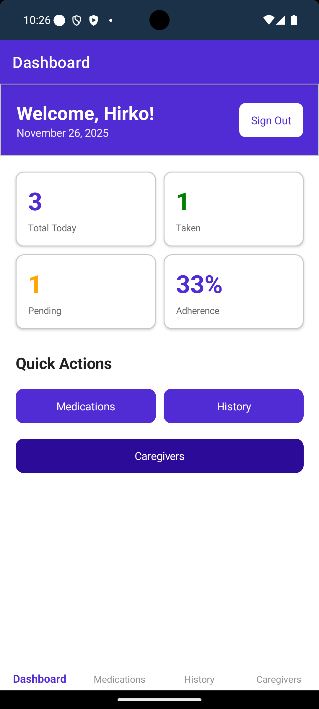
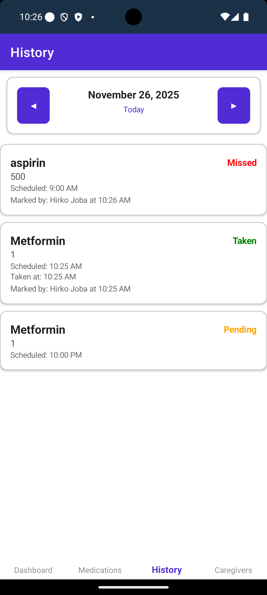

# MedsConnect - Medication Tracker App

A comprehensive .NET MAUI cross-platform medication tracking application that helps users manage their medications, track adherence, and share progress with caregivers.

## Features

### User Management
- User registration and authentication
- Secure password hashing
- Profile management with personal information

### Medication Management
- Add, edit, and delete medications
- Track dosage, frequency, and scheduled times
- Set start and end dates for medications
- Mark medications as active or inactive
- Add notes and descriptions for each medication

### Medication Tracking
- Daily dashboard showing today's medication schedule
- Mark medications as taken, missed, or skipped
- View medication history by date
- Track adherence statistics (30-day rolling average)
- Automatic log generation for scheduled medications

### Reminders & Notifications
- Set customizable reminder times for each medication
- Local push notifications (15 minutes before scheduled time by default)
- Enable/disable reminders per medication
- Daily repeating notifications

### Caregiver Support
- Add caregivers by email
- Approve/reject caregiver requests
- Configure caregiver permissions:
  - View medications
  - View medication logs
  - Receive alerts
- View patients you care for
- Track multiple patients' medication adherence

## Screenshots

### Authentication & Onboarding

<p align="center">
  
</p>

**User Authentication:** Secure login screen with email and password authentication. Implements password hashing with SHA256 and uses MAUI SecureStorage for credential persistence across app sessions.

<p align="center">
  
</p>

**Notification Permissions:** On first use, the app requests notification permissions to enable medication reminders. Handles Android 13+ runtime permissions with proper fallback handling.

---

### Dashboard & Medication Tracking

<p align="center">
  
</p>

**Daily Dashboard:** Real-time view of today's medication schedule with color-coded status indicators. Displays adherence statistics including total medications, taken count, pending count, and 30-day rolling adherence percentage. Users can quickly mark medications as taken with a single tap.

<p align="center">
  
</p>

**Medication Management:** Complete list of all active medications with dosage information, frequency, and scheduled times. Supports filtering between active and inactive medications. Each medication card displays key information at a glance.

<p align="center">
  
</p>

**Active & Inactive Medications:** Toggle view showing both active and inactive medications. Users can easily manage their complete medication history and reactivate previous medications as needed.

---

### Medication Management

<p align="center">
  
</p>

**Add Medication - Basic Info:** Comprehensive form for adding new medications with fields for name, dosage, unit, frequency, and detailed notes. Input validation ensures data integrity.

<p align="center">
  
</p>

**Add Medication - Schedule & Reminders:** Set multiple scheduled times per day using time pickers. Configure reminder settings including reminder offset time (default 15 minutes before). Supports start and end dates for temporary medications.

<p align="center">
  
</p>

**Local Push Notifications:** System-level notifications remind users to take medications at scheduled times. Notifications include medication name and dosage. Tapping opens the app directly to the medication details.

---

### History & Analytics

<p align="center">
  
</p>

**Medication History:** Calendar-based view of medication logs with date filtering. Shows detailed history of all medications taken, missed, or skipped with timestamps. Users can add notes to individual log entries for tracking side effects or other observations.

---

### Caregiver Features

<p align="center">
  
</p>

**Patient - Send Caregiver Request:** Patients can add caregivers by email address and specify the relationship type (family member, healthcare provider, friend). Configurable permissions allow patients to control what data caregivers can access.

<p align="center">
  
</p>

**Caregiver - Receive Request:** Caregivers receive and can approve or reject patient requests. The approval system ensures both parties consent to the relationship before data sharing begins.

<p align="center">
  
</p>

**Patient - Caregiver List:** Patients can view all their approved caregivers with relationship details and permission levels. Options to modify permissions or remove caregivers maintain patient control over their data.

<p align="center">
  
</p>

**Caregiver - Patient List:** Caregivers can manage multiple patients from a single interface. Shows list of all patients who have granted access, with quick navigation to each patient's medication data.

<p align="center">
  
</p>

**Caregiver - View Patient Dashboard:** Caregivers can view their patients' medication schedules and adherence statistics based on granted permissions. This enables remote monitoring and support for medication adherence.

<p align="center">
  
</p>

**Caregiver - Mark Medications Taken:** With appropriate permissions, caregivers can mark medications as taken on behalf of their patients. Useful for elderly patients, children, or those needing assistance with medication management.

## Download

**[Download Android APK (v1.0.0)](https://github.com/hirkojoba/MedsConnect/releases/latest)**

Install the APK on your Android device to try out MedsConnect!

## Architecture

### Technology Stack
- **.NET 9.0**
- **.NET MAUI** - Cross-platform framework
- **Entity Framework Core 9.0** - ORM for database management
- **SQLite** - Local database storage
- **CommunityToolkit.Maui 10.0** - Enhanced UI controls
- **CommunityToolkit.Mvvm** - MVVM helpers and commands
- **Plugin.LocalNotification** - Local push notifications

### Project Structure

```
MedsConnect/
├── Models/                          # Data models
│   ├── User.cs
│   ├── Medication.cs
│   ├── MedicationLog.cs
│   └── CaregiverRelationship.cs
├── ViewModels/                      # MVVM ViewModels
│   ├── BaseViewModel.cs
│   ├── LoginViewModel.cs
│   ├── RegisterViewModel.cs
│   ├── DashboardViewModel.cs
│   ├── MedicationsViewModel.cs
│   ├── AddEditMedicationViewModel.cs
│   ├── HistoryViewModel.cs
│   └── CaregiversViewModel.cs
├── Views/                           # XAML Views
│   ├── LoginPage.xaml
│   ├── RegisterPage.xaml
│   ├── DashboardPage.xaml
│   ├── MedicationsPage.xaml
│   ├── AddEditMedicationPage.xaml
│   ├── HistoryPage.xaml
│   └── CaregiversPage.xaml
├── Services/                        # Business logic services
│   ├── IAuthenticationService.cs
│   ├── AuthenticationService.cs
│   ├── IMedicationService.cs
│   ├── MedicationService.cs
│   ├── IMedicationLogService.cs
│   ├── MedicationLogService.cs
│   ├── ICaregiverService.cs
│   ├── CaregiverService.cs
│   ├── INotificationService.cs
│   └── NotificationService.cs
├── Data/                            # Database context
│   └── MedsConnectDbContext.cs
├── Converters/                      # XAML value converters
│   ├── StringToBoolConverter.cs
│   ├── InvertedBoolConverter.cs
│   ├── MedicationStatusToColorConverter.cs
│   └── ... (13 converters total)
├── Helpers/                         # Utility classes
│   └── PasswordHelper.cs
├── Resources/                       # App resources
│   └── Styles/
│       ├── Colors.xaml
│       └── Styles.xaml
└── Platforms/                       # Platform-specific code
    ├── Android/
    ├── iOS/
    └── Windows/
```

## Database Schema

### Users Table
- Id (PK)
- Username (unique)
- Email (unique)
- PasswordHash
- FirstName, LastName
- DateOfBirth
- CreatedAt, LastLoginAt

### Medications Table
- Id (PK)
- UserId (FK)
- Name, Description
- Dosage, Unit
- Frequency
- ScheduledTimes (JSON array)
- StartDate, EndDate
- IsActive
- ReminderEnabled, ReminderMinutesBefore
- Notes

### MedicationLogs Table
- Id (PK)
- MedicationId (FK)
- UserId (FK)
- ScheduledDateTime
- TakenDateTime
- Status (Pending, Taken, Missed, Skipped)
- Notes

### CaregiverRelationships Table
- Id (PK)
- PatientId (FK)
- CaregiverId (FK)
- Relationship
- IsApproved
- RequestedAt, ApprovedAt
- CanViewMedications, CanViewLogs, CanReceiveAlerts

## Key Features Implementation

### Authentication & Security
- Password hashing using SHA256
- Secure credential storage using MAUI SecureStorage
- Session persistence across app restarts

### MVVM Pattern
- Uses CommunityToolkit.Mvvm for clean MVVM implementation
- ObservableProperty and RelayCommand attributes
- Dependency injection for all services and ViewModels

### Database Management
- Entity Framework Core with SQLite
- Automatic database creation on first run
- Relationship configurations with proper cascade/restrict rules
- JSON serialization for complex types (List<TimeSpan>)

### Notifications
- Platform-specific local notifications
- Daily repeating schedules
- Android notification permissions handling
- Unique notification IDs per medication and time

## Setup & Installation

### Prerequisites
- .NET 9.0 SDK or later
- Visual Studio 2022 (17.12+) or Visual Studio Code with .NET MAUI extension
- For Android: Android SDK (API 21+)
- For iOS: Xcode and Mac build host
- For Windows: Windows 11 (10.0.22000.0) or later

### Build Instructions

1. **Clone or navigate to the project:**
   ```bash
   cd MedsConnect
   ```

2. **Restore NuGet packages:**
   ```bash
   dotnet restore
   ```

3. **Build the project:**
   ```bash
   dotnet build
   ```

4. **Run on specific platform:**
   ```bash
   # Android
   dotnet build -t:Run -f net9.0-android

   # iOS
   dotnet build -t:Run -f net9.0-ios

   # Windows 11
   dotnet build -t:Run -f net9.0-windows10.0.22000.0
   ```

### Configuration

No additional configuration required. The app will:
- Create the SQLite database automatically on first run
- Store database at: `FileSystem.AppDataDirectory/medsconnect.db3`
- Request notification permissions on first notification schedule

## Usage Guide

### Getting Started
1. Launch the app
2. Register a new account with your email
3. Log in with your credentials

### Adding Medications
1. Navigate to "Medications" tab
2. Tap "+ Add" button
3. Fill in medication details:
   - Name (required)
   - Dosage and unit (required)
   - Frequency
   - Scheduled times (add at least one)
   - Optional: description, notes, end date
4. Enable reminders if desired
5. Save

### Daily Tracking
1. Dashboard shows today's scheduled medications
2. Tap checkmark (✓) to mark as taken
3. View statistics: total, taken, pending, adherence %
4. Refresh to update the list

### Adding Caregivers
1. Navigate to "Caregivers" tab
2. Tap "+ Add Caregiver"
3. Enter caregiver's registered email
4. Select relationship type
5. Send request
6. Caregiver must approve the request

## Platform-Specific Notes

### Android
- Requires notification permissions (Android 13+)
- Uses AndroidX compatibility
- Minimum SDK: API 21 (Android 5.0)
- Target SDK: API 34 (Android 14)

### iOS
- Requires notification authorization
- Minimum version: iOS 12.0
- Uses UIKit underneath

### Windows
- Minimum version: Windows 11 (Build 22000)
- Notification support via Windows Notification Service

## Security Considerations

- Passwords are hashed using SHA256 (consider upgrading to bcrypt/Argon2 for production)
- Credentials stored in platform-specific secure storage
- SQLite database is local and not encrypted (consider encryption for sensitive medical data)
- No server-side authentication (local-only app)

## Future Enhancements

Potential features for future versions:
- Cloud sync across devices
- Medication interaction warnings
- Pharmacy integration
- Prescription image capture
- Health metrics tracking
- Export reports (PDF/CSV)
- Multi-language support
- Dark mode
- Biometric authentication
- Medication barcode scanning
- Refill reminders
- Doctor appointment reminders

## License

This project is provided as-is for educational and personal use.

## Support

For issues or questions, please refer to the project documentation or contact the development team.

---

**Built with .NET MAUI** | **Version 1.0.0**
